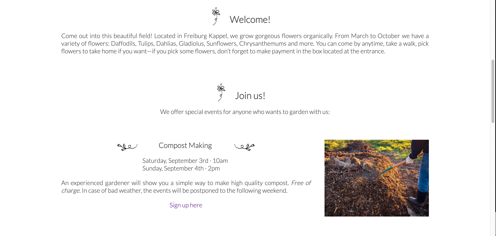
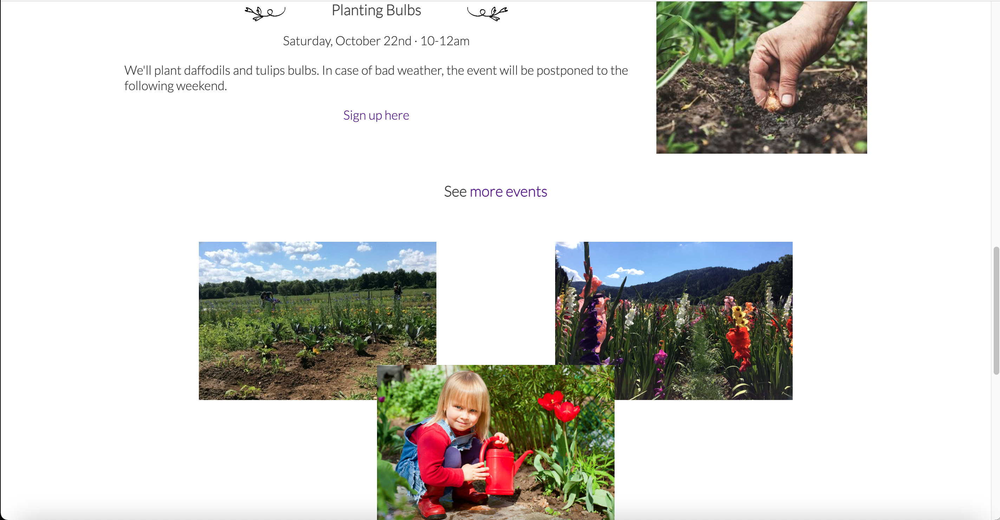
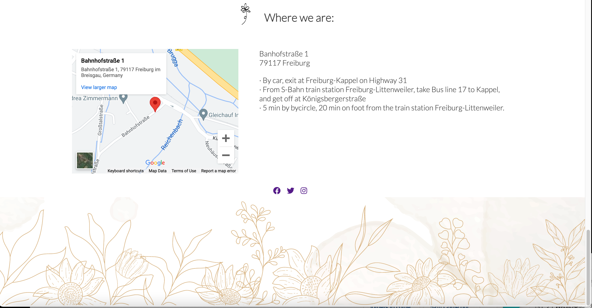
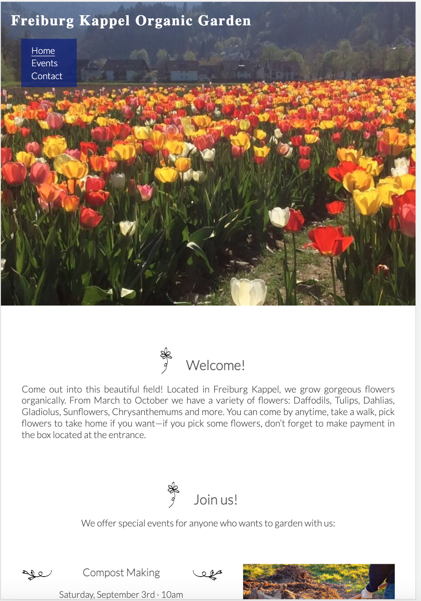
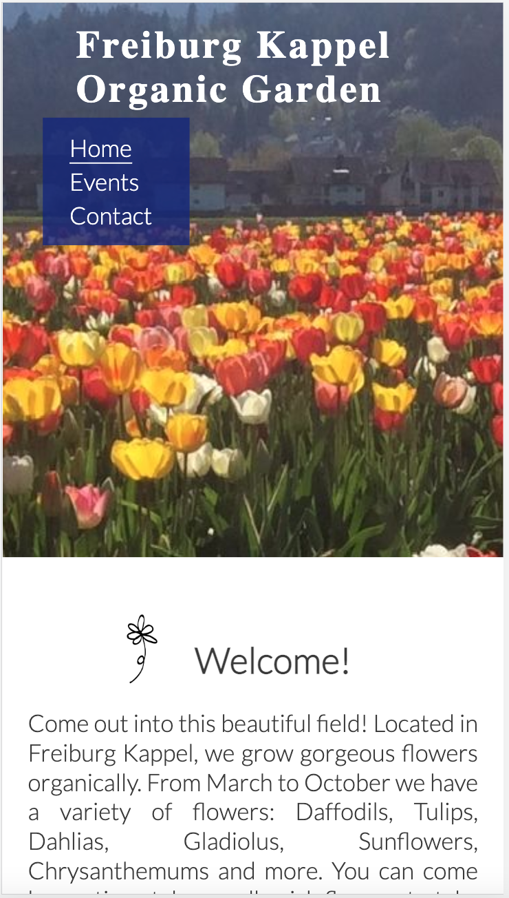

# Freiburg Kappel Organic Garden

## Description: 
* This web application introduces Freiburg Kappel Organic Garden, where flowers are grown organically and visitors are welcomed throughout the year. (This place really exists but not at the address given on the page. The events described on the pages are not actually held-- they are my fantasies for the sake of this assignment.)

* On the web pages readers can see various photos of the garden and get information about the events and directions to the garden. The contact page offers a form, with which readers should be able to sign up for the events, or send messages to personnel. The input data will not be sent to a database, but the function will be implemented in the future.

* The pages are made responsive for desktops, laptops, ipads and mobile phones.

## Images:

* "Home" page displayed on large screen

* "Home" page displayed on iPads and mobile phones

## Technologies used: 
Html and CSS

## Credits: 
* Some corrections and suggestions on the code were given by Jubril Acolade and were incorporated.

* Font Lato was imported from Google Fonts.

* Three of the photos (the compost pile, a
 hand planting a bulb & a girl watering a red tulip) were downloaded from Shutterstock: 
https://www.shutterstock.com/ja/image-photo/little-girl-posing-red-watering-can-104304419

https://www.shutterstock.com/ja/image-photo/womens-hand-soilsoil-flower-bulbs-close-655746205

https://www.shutterstock.com/ja/image-photo/person-building-permaculture-hill-mound-using-1858739254

All other photos were taken by myself.

* Two flower icons next to headings were taken from Freepik: 
https://www.freepik.com/free-vector/hand-drawn-flower-set_4089974.htm#query=flower%20graphic&position=40&from_view=search

* The sitemap was taken from Google Map.

* The social network icons (Facebook, Twitter and Instagram) were taken from Font Awesome.

* The floral graphic in the footer was taken from Freepik: 
https://www.freepik.com/free-vector/hand-drawn-monoline-floral-decorative-elements-background_24858693.htm#query=black%20white%20graphics%20flower&position=5&from_view=search