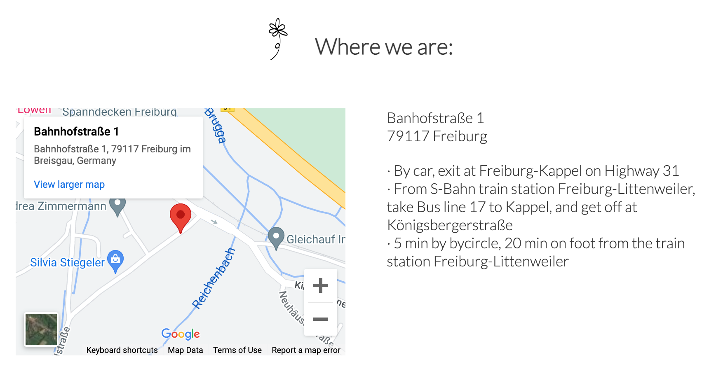

# Freiburg Kappel Organic Garden

## Description: 
* This web application introduces Freiburg Kappel Organic Garden, where flowers are grown organically and visitors are welcomed throughout the year. 

* On the web pages readers can see various photos of the garden and get information about the events as well as directions to the garden. The contact page offers a form, with which readers should be able to sign up for the events, or send messages to personnel. The input data will not be sent to a database, but the function will be implemented in the future.

## Features
### Navigation (Common for all three pages)

* The navigation shows the name of the garden in the left corner: Freiburg Kappel Organic Garden, which links to the top of “Home” page. 
* Just below that, the navigation menu is placed, offering links to different pages: Home, Events and Contact.  
* The dark blue color of the menu makes the white letters easily readable.  
* The navigation clearly tells the name of the website, which is also the name of the garden.  
* The titles of all three pages are clearly defined so users can easily access the information they need.     

### "Home" page
#### Welcome section 

* Welcome section offers a welcome message, invites users to visit the place and provides them with a general overview of the garden.
* Flower icons are used for the title of this section (in other sections and paragraphs as well.)
* These make the page more visually enjoyable.    

#### Join us section 

* The title and the one-line introduction call users to participate in the events at the garden. 
* The section introduces two upcoming events.
* The descriptions of the events give users important information about the events.  
* The descriptions are accompanied by photos, letting users get the feel for the events.
* At the end of each description, a link to “Contact” page is placed, where users can sign up for the events or write to personnel.  
* Then comes another link to “Events” page, which shows the list of the events held at the garden throughout the year. 
* The links offer users quick access to the events list and to the contact form—-two important elements of this web application.
* At the bottom of the section, additional photos are displayed so users can get an impression of what the garden is like.  

#### The Where we are section

* The section shows a map imported from google map and the address of the garden as well as directions, all of which are valuable for those who plan to visit the place.    

#### The Footer (common for "Home" and "Events" pages)

* The footer offers links to social networks: Facebook, Twitter and Instagram.
* A floral graphic is applied as decoration, adding an elegant style to the page. 

#### "Events" page 

* The page includes a table where the events at the garden are listed in the calendrical order.
* This list is valuable since it informs users about the events held at the garden throughout the year.   
* Four photos of different flowers cropped in circle are placed as decorations.   
* These photos are also valuable as users can see what beautiful flowers the garden has to offer.   

#### "Contact" page

* The page contains a form, with which users can sign up for events or simply write to personnel.  
* The form collects users’ first names, last names, emails, their options for which event(s) they want to sign up for (optional) and/or comments (optional).
* The form is important as it allows users to sign up for the events or contact the personnel.   
* On this page, I made a dark background for the logo in order to make a sufficient contrast.
* For the background of the form, I used a dark gray color so that the white letters on the form are easily readable. 
* The modest color was applied also in order to avoid interfering with the colors of the flowers in the surrounding image and is made somewhat transparent so as not to block the view of the flowers completely.  

## Testing 
* I checked that these pages work well in different browsers: Chrome, Safari and Firefox.
* I tested that these pages are responsive—are displayed fine and function well in all standard screen sizes by using the devtools device toolbar.  
* I confirmed that all texts on the pages are easily readable and understandable.  
* I tested that all links lead to specified destinations.  
* As for the form on “Contact” page, I tested that a message would remind users to fill out required fields if those fields (first name, last name and email) are left empty.  If a text without “@” sign is entered for the email, another pop-up tells users to correct the input. 

## Bugs 
No validation messages showed up for the form. 
I fixed it by changing the value of the type attribute in the input tag in line 56 of contact.html from “button” to “submit.” 

## Validator Testing
### HTML
The following errors were found with the official W3C validator and were corrected:
* Some id names were used for two different tags.
* id attributes were missing in input tags in contact.html. 
* There were improper line breaks in the value of the source attribute in iframe tag. 

### CSS
* No errors were found by the official (Jigsaw) validator.     

## Accessibility and Performance 
The following items were pointed out by lighthouse in devtools and were corrected:
* I resized the images so the pages load faster.  
* I changed the color of the submit button in contact.html in order to make the letters easily readable. 
* I added "title" property in the iframe tag.
* I changed h3 text to h2 at line 30 in contact.html ir order to have heading elements in a sequentially descending order.  

## Unfixed bugs 
There are no unfixed bugs. 

## Deployment
The site was deployed to GitHub pages.  
The steps to deploy: 
* In the Github repository, click on the Settings tab.
* Click on “Pages” in the left column.
* Under “Build and deployment,” select “deploy from a branch,” “main” and “/root” as in the photo below.
* Then the link to the website will appear on the top of the page. 
* the live link to the website: [Freiburg Kappel Organic Garden](https://rkyzk.github.io/freiburg-kappel-organic-garden/)

## Credits
### Content
* Some corrections and suggestions on the code were given by Jubril Acolade and were incorporated.
* The code of social media links was taken from Code Institute’s Love Running Project.

### Medias
* The three photos were downloaded from Shutterstock: 

https://www.shutterstock.com/ja/image-photo/little-girl-posing-red-watering-can-104304419

https://www.shutterstock.com/ja/image-photo/womens-hand-soilsoil-flower-bulbs-close-655746205

https://www.shutterstock.com/ja/image-photo/person-building-permaculture-hill-mound-using-1858739254

* All other photos were taken by myself.  
* The two flower icons in index.html were taken from Freepik: 
https://www.freepik.com/free-vector/hand-drawn-flower-set_4089974.htm#query=flower%20graphic&position=40&from_view=search

* Font Lato was imported from Google Fonts.
* The sitemap was taken from Google Map.
* The social network icons (Facebook, Twitter and Instagram) were taken from Font Awesome.
* The floral graphic in the footer was taken from Freepik:
https://www.freepik.com/free-vector/hand-drawn-monoline-floral-decorative-elements-background_24858693.htm#query=black%20white%20graphics%20flower&position=5&from_view=search
