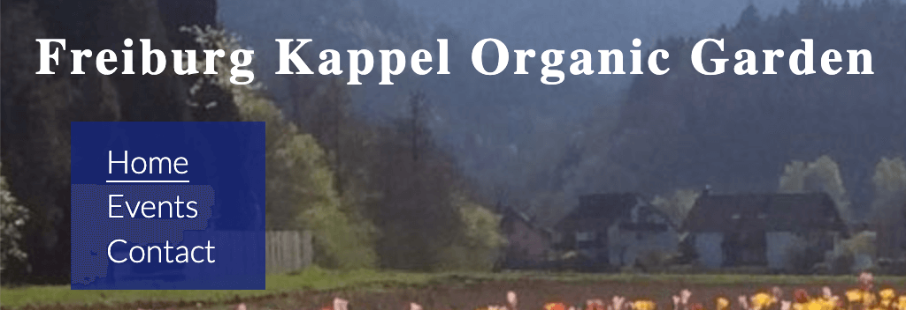
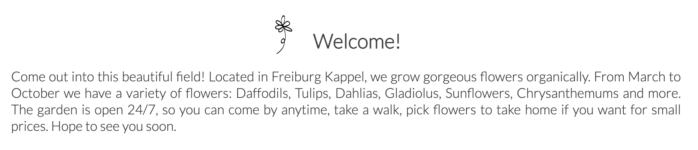

# Freiburg Kappel Organic Garden

## Description: 
* This web application introduces Freiburg Kappel Organic Garden, where flowers are grown organically and visitors are welcomed throughout the year. 

* On the web pages readers can see various photos of the garden and get information about the events as well as directions to the garden. The contact page offers a form, with which readers should be able to sign up for the events, or send messages to personnel. The input data will not be sent to a database, but the function will be implemented in the future.

## Features
### Navigation (Common for all three pages)

* The navigation shows the name of the garden in the left corner: Freiburg Kappel Organic Garden, which links to the top of “Home” page. 
* Just below that, the navigation menu is placed, offering links to different pages: Home, Events and Contact.  
* The dark blue color of the menu makes the white letters easily readable.  
* The navigation clearly tells the name of the website, which is also the name of the garden.  
* The titles of all three pages are clearly defined so users can easily access the information they need.     

### "Home" page
#### Welcome section 

* Welcome section offers a welcome message, invites users to visit the place and provides them with a general overview of the garden.
* The section establishes a friendly and welcoming ambient for the users.  
* Flower icons are used for the title of this section (in other sections and paragraphs as well.)
* These make the page more visually enjoyable.    

### Join us section 

* The title and the one-line introduction call users to participate in the events at the garden, engaging them. 
* Then the section introduces two upcoming events.
* The descriptions of the events concisely give users important information about the events.  
* The descriptions are accompanied by photos so that users get the feel for the events.
* At the end of each description, a link to “Contact” page is placed, where users can sign up for the events or write to personnel.  
* Then comes another link to “Events” page, which shows the list of the events held at the garden throughout the year. 
* The links offer users quick access to the events list and to the contact form—two important elements of this web application.
* At the bottom of the section, additional photos are displayed so users can get an impression of what the garden is like.  

### The Where we are section

* The section shows a map imported from google map and the address of the garden as well as directions, all of which are valuable for those who plan to visit the place.    

### The Footer (common for Home and Events pages)

* The footer offers links to social networks including Facebook, Twitter and Instagram.
* A floral graphic is applied as decoration, adding an elegant style to the page. 

## Technologies used: 
Html and CSS

## Credits: 
* Some corrections and suggestions on the code were given by Jubril Acolade and were incorporated.

* Font Lato was imported from Google Fonts.

* Three of the photos (the compost pile, a
 hand planting a bulb & a girl watering a red tulip) were downloaded from Shutterstock: 
https://www.shutterstock.com/ja/image-photo/little-girl-posing-red-watering-can-104304419

https://www.shutterstock.com/ja/image-photo/womens-hand-soilsoil-flower-bulbs-close-655746205

https://www.shutterstock.com/ja/image-photo/person-building-permaculture-hill-mound-using-1858739254

All other photos were taken by myself.

* Two flower icons next to headings were taken from Freepik: 
https://www.freepik.com/free-vector/hand-drawn-flower-set_4089974.htm#query=flower%20graphic&position=40&from_view=search

* The sitemap was taken from Google Map.

* The social network icons (Facebook, Twitter and Instagram) were taken from Font Awesome.

* The floral graphic in the footer was taken from Freepik: 
https://www.freepik.com/free-vector/hand-drawn-monoline-floral-decorative-elements-background_24858693.htm#query=black%20white%20graphics%20flower&position=5&from_view=search